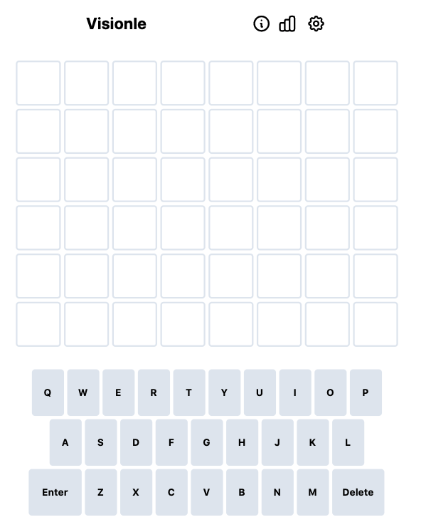
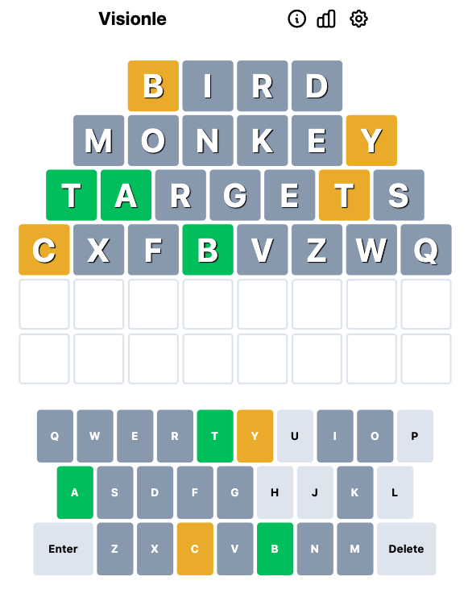
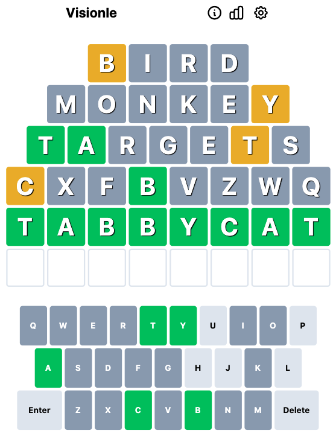
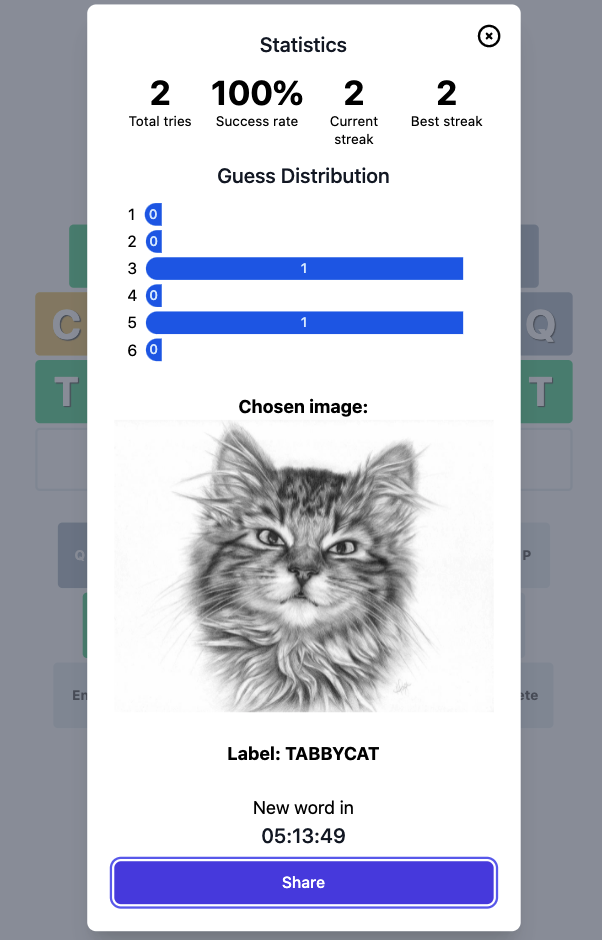
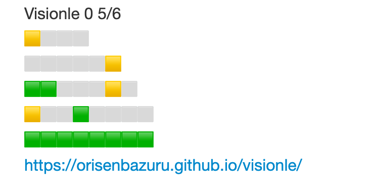

This is a clone project of the popular word guessing `Wordle`. 

[**👾 Play the demo here 🕹️**](https://orisenbazuru.github.io/visionle/)

### How to play 🕹️

Each day a random image is selected from the `ImageNet-Sketch` dataset and the goal is to guess one of the labels associated with the image in 6 tries.

#### Game simulation
 - `Visionle` chooses the following image 🐈 and its associated challenge word will be `tabbycat`. 
 - Users will be presented with 8 empty cells and 6 tries to figure out the challenge word `tabbycat`
 - Users can input any combination of letters equal or shorter than 8 letters. This is different from the typical game setup of `Wordle` and we refer to this play mode by `Looney Mode` 🤪
 - The `Hard Mode` 🏋️ restricts the users to input only variation of words from the whole set of labels found in the `ImageNet-Sketch` dataset.
 - Example of `game run` with `tabbycat` challenge is presented below:
   - Entry screen 💻    
   - Guessing with trial and error 🤔. Notice that you can use `shorter words` and `non valid words` (i.e. any letter combination)   
   - Success 🎉   
   - Stats screen 📊 after the end of trials   
   - Sharing results by clicking on `Share`   

### Extension to support ML model prediction
The current version of `Visionle` can be easily extended/modified to use the prediction of a trained `Machine learning model` such as `EfficentNet` or `Vit` on the `ImageNet` dataset. In fact, the code/logic of this setup is already implemented - what is needed is `some slight modification` of `word.ts` file and dumping the predictions of the model in a `json` file. I will leave this as an exercise for the reader 😅 (until I get the time to push that in version `0.2`).

### Credits

This repo is build on the code from [react-wordle](https://github.com/cwackerfuss/react-wordle) (awesome open source version of `Wordle`).
